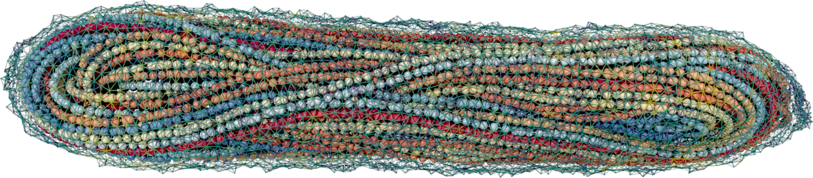

# HOOMD-Nucl

MD simulations of worm-like chains within polymerized elastic shells.

## Requirements

* `python` >= 3.0
* [**`HOOMD-blue`**](http://glotzerlab.engin.umich.edu/hoomd-blue/) == 2.7.0
* [**`ovito`**](http://www.ovito.org/) == 2.9.0

The required Python modules not included in the built-in standard library (`GPUtil`, `gsd`, `scipy`) may be installed in the ordinary fashion through the `pip` package manager,

~~~shell
<path_to_python> -m pip install <module>
~~~

## Output

The output data is provided in the [**GSD**](https://gsd.readthedocs.io/en/v2.6.0/) file format, which may be natively visualized using the `ovito` open-source software. The `NuclModifier.py` Python pipeline is provided to further customize visualization options. Exemplary crumpled globule (`crumpled.gsd`), spool-like (`spool.gsd`), stretched (`stretched.gsd`) and twisted (`twisted.gsd`) nuclear configurations obtained from the simulations are also included within the `samples` folder.

## Run

Chromatin acetylation may be simulated using the command

~~~shell
<path_to_python> HoomdNucl.py 10000 1 0.25 --propagate --file_init samples/crumpled.gsd
~~~

Nuclear stretching runs may be performed via

~~~shell
<path_to_python> HoomdNucl.py 10000 1 0.25 --sweep force --file_init samples/spool.gsd
~~~

Geometrical twisting of the stretched nucleus by 5 turns (10$\pi$) about the elongation axis may be achieved through

~~~shell
<path_to_python> twist.py samples/stretched.gsd 5
~~~

Nuclear decondensation may finally be simulated as follows,

~~~shell
<path_to_python> HoomdNucl.py 10000 1 0.25 --decondense --file_init samples/twisted.gsd
~~~

A full list of simulation options and parameters may be obtained via

~~~shell
<path_to_python> HoomdNucl.py --help
~~~

## Credits

Implemented and maintained by [Maxime Tortora](mailto:maxime.tortora@icloud.com).
